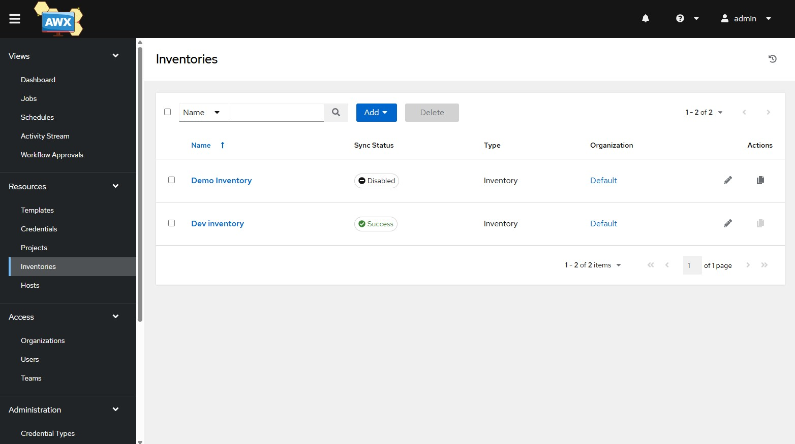
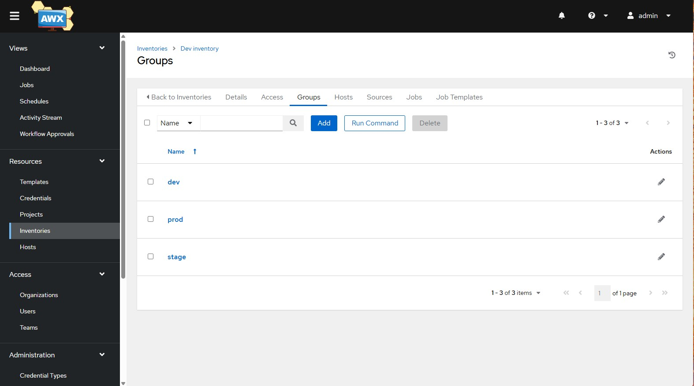
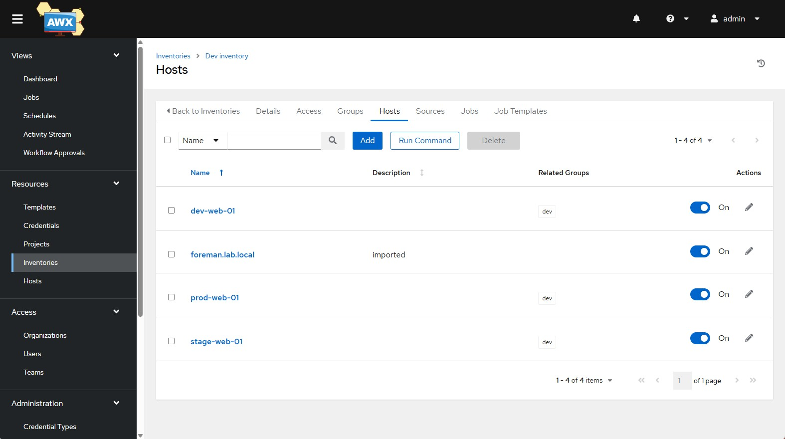

# Enterprise Infrastructure Automation Lab

This project demonstrates a complete enterprise-style infrastructure automation platform built using open-source DevOps tools.

The lab simulates how organizations automate Linux infrastructure using GitOps workflows and configuration management.

---

## Technologies Used

- GitLab CE
- AWX (Ansible Automation Platform)
- Foreman / Katello
- Ansible
- Kubernetes (k3s)
- Rocky Linux 9

---

## Infrastructure Architecture

## Infrastructure Architecture

```mermaid
flowchart LR
    A[GitHub / GitLab<br>Source Control & CI/CD] --> B[AWX<br>Ansible Automation Platform]
    B --> C[Foreman / Katello<br>Lifecycle & Content Management]
    C --> D[Linux Infrastructure]

    D --> E[dev-web-01<br>192.168.111.101]
    D --> F[stage-web-01<br>192.168.111.102]
    D --> G[prod-web-01<br>192.168.111.103]


This diagram shows the **platform architecture**:

GitHub/GitLab
│
▼
AWX
│
▼
Foreman/Katello
│
▼
Linux Servers
├ dev
├ stage
└ prod

The environment contains several virtual machines connected through an internal lab network.

Network:

192.168.111.0/24  
Domain: lab.local

| Host | Role | IP |
|-----|-----|-----|
| gitlab.lab.local | Source control & CI/CD | 192.168.111.10 |
| awx.lab.local | Automation platform | 192.168.111.30 |
| foreman.lab.local | Lifecycle management | 192.168.111.20 |
| dev-web-01 | Development server | 192.168.111.101 |
| stage-web-01 | Staging server | 192.168.111.102 |
| prod-web-01 | Production server | 192.168.111.103 |

---

## Automation Workflow
GitLab → AWX → Foreman → Linux Servers

1. Infrastructure code is stored in GitLab.
2. AWX executes Ansible playbooks.
3. Foreman provides dynamic inventory and lifecycle management.
4. Linux servers are automatically configured.


---

# 2️⃣ Automation Workflow Diagram

Add this under a new section called **Automation Workflow**.

```markdown
## Automation Workflow

```mermaid
flowchart TD
    A[Developer pushes code] --> B[GitHub / GitLab Repository]
    B --> C[AWX Project Sync]
    C --> D[AWX Job Template Execution]
    D --> E[Ansible Playbook]
    E --> F[Foreman Dynamic Inventory]
    F --> G[Linux Servers Configured]

    G --> H[dev environment]
    G --> I[stage environment]
    G --> J[prod environment]


This diagram represents the **GitOps automation flow**:

Git Push
│
▼
GitHub/GitLab
│
▼
AWX Sync
│
▼
AWX Job
│
▼
Ansible Playbook
│
▼
Foreman Inventory
│
▼
Linux Servers
(dev / stage / prod
---

## Example Playbook

Location:
ansible/playbooks/configure_base.yml


The playbook performs:

- system updates
- package installation
- service configuration
- baseline system setup

---

## Features

✔ Infrastructure as Code  
✔ Dynamic inventory integration  
✔ Multi-environment infrastructure  
✔ Automated configuration management

---
## AWX Platform Screenshots

### AWX Inventory


### AWX Groups


### AWX Hosts



## Future Improvements

- GitLab CI pipeline triggering AWX jobs
- Automated host registration
- Infrastructure monitoring integration
- Patch management automation

---

## Author

DevOps Automation Lab Project

